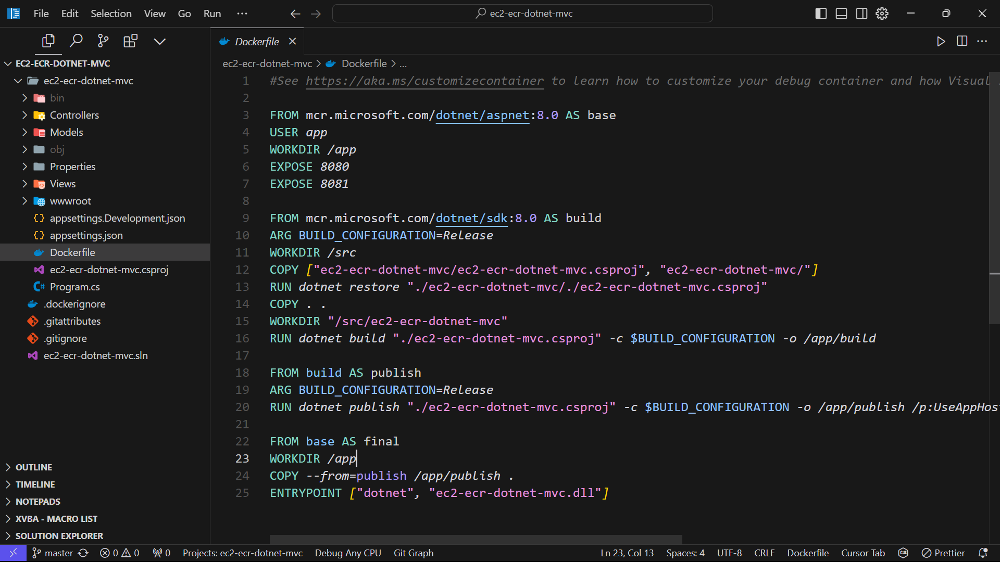

# 2024/12/19 基於 AWS EC2、ECR容器 的 Api 服務

# ECR ([**Amazon Elastic Container Registry**](https://ap-northeast-1.console.aws.amazon.com/ecr/get-started?region=ap-northeast-1)) 簡介

---

Amazon Elastic Container Registry （Amazon ECR） 是一種安全、可擴展且可靠的 AWS 受管容器映像登錄服務。Amazon 使用 ECR支援具有資源型許可的私有儲存庫 AWS IAM。這是為了讓指定的使用者或 Amazon EC2執行個體可以存取您的容器儲存庫和映像。您可以使用您偏好的 CLI 來推送、提取和管理 Docker 映像、Open Container Initiative （OCI） 映像和OCI相容的成品。

定價方面

作為 [AWS 免費方案](https://aws.amazon.com/free/)的一部分，Amazon ECR 新客戶可獲得私有儲存庫每月 500 MB 的儲存空間，為期一年。

新客戶和現有客戶的公共儲存庫每月均可獲得 50 GB 的永久免費儲存空間。您每月可以免費從公有儲存庫，以匿名方式 (不使用 AWS 帳戶) 將 500 GB 資料傳輸至網際網路。如果您註冊 AWS 帳戶，或使用現有 AWS 帳戶向 Amazon ECR 進行身份驗證，您可以每月免費從公共儲存庫向網際網路傳輸 5 TB 資料。將資料從公共儲存庫傳輸到任何 AWS 區域中的 AWS 運算資源時，您還可以免費獲得無限頻寬

# EC2 ( Elastic Compute Cloud ) 簡介

---

EC2 (Elastic Compute Cloud) 是 AWS 提供的雲端運算服務，主要功能如下：

- 提供可擴展的虛擬伺服器
- 可自由選擇作業系統(Linux, Windows等)
- 可依需求調整運算效能
- 按使用量計費

## **免費方案 (Free Tier) 限制**

AWS 提供 12 個月的免費方案，主要限制如下：

### **每月免費額度**

- 750 小時的 t2.micro 或 t3.micro 執行時間
- 相當於一台機器全天候運行 (24x31 = 744小時)
- 或是兩台機器分時使用，總時數不超過750小時

### **規格限制**

- 僅限使用 t2.micro 或 t3.micro 實例
- 1 個 vCPU
- 1 GB 記憶體
- 有限的網路效能

### **儲存限制**

- 30GB 的 EBS (彈性區塊儲存) 空間
- 每月 1GB 的資料傳輸

# 基於 EC2 使用 ECR 的容器化服務

---

### 透過EC2 與ECR可以達成的基礎應用

- 容器化應用部署
- 將應用程式打包成容器
- 統一開發和生產環境
- 快速部署和擴展
- 微服務架構
- 將大型應用拆分成小型服務
- 獨立部署和擴展
- 更容易維護和更新

# 開始使用

---

以下先透過Root 帳號建立服務，

## 本地開發 ( 以 .NET 8 MVC 舉例 )



建立好專案，並完成 DockerFile


安裝 AWS CLI

## **設定 [Amazon Elastic Container Registry](https://ap-northeast-1.console.aws.amazon.com/ecr/get-started?region=ap-northeast-1)**

1. 建立 [**Amazon Elastic Container](https://ap-northeast-1.console.aws.amazon.com/ecr/get-started?region=ap-northeast-1) 的 Repository**
    
    
    
    點擊 “建立儲存庫”
    
2. 設定 Repository名稱、可變性
    
    
    
    設定 repository 名稱，並使用預設可變性，選擇 "Mutable”
    
3. 加密設定


選擇預設的 “AES-256 ”，AES-256在此處已經足夠使用，按下建立

1. 確認 Repo 的建立


確認剛剛建立的 repo 已經出現在 ECR 服務的列表中

## 設定 [**Identity and Access Management (IAM)](https://us-east-1.console.aws.amazon.com/iam/home?region=ap-northeast-1#/home)**

1. 人員設定
    
    
    
    選取 "人員”，選擇  “建立人員”
    
2. 設定人員全組
    
    
    
    設定人員名稱，選擇下一步
    
    
    
    選擇 “在群組中新增人員”，接著選 “建立群組”
    
    
    
    測試或練習時使用full access，若正式環境假設於 ec2 可選擇 ecr readonly
    
    
    
    點選剛剛建立的群組並下一步建立人員
    
    
    
    於列表中點選剛剛建立的 IAM
    
    ](image%2012.png)
    
    Tab 中選擇 “安全憑證” 並點選 “建立存取金鑰”，
    ** 先決條件 :  安裝 [aws cli](https://docs.aws.amazon.com/zh_tw/cli/latest/userguide/getting-started-install.html)
    
    
    
    此 IAM 為 full access，所以選擇 “在AWS運算服務上執行的應用程式”，點選下一步
    
    
    
    此處選用，可直接按下建立存取金鑰
    
    
    
    下載csv檔案，並按下完成。
    

## 設定  Amazon Elastic Compute Cloud (Amazon EC2)


點選啟動執行個體


輸入名稱，選擇amazon linux 或 ubuntu，使用最低配置以符合免費方案


點選 “建立新的金鑰對”，這個金鑰用於登入此裝置


選擇 ”建立新的金鑰對”，填入金鑰名稱，選擇RSA，下載.pem格式金鑰檔


設定網路，允許SSH可改為 ”我的IP”，並啟動執行個體

## 推送 Image 至 ECR


開啟 pw 輸入 “aws configuire”， 依序填入 ecr-full-access 之 IAM 金鑰


於ECR點擊repo並點選右上角 “**檢視推送命令**”，可以看到 init 的 push command


依照指令登入 透過 aws cli 登入 ecr


於專案資料夾下透過 dockerfile 建立 image。

```powershell
// 打包專案為 image 檔案，本版為 1.0.0
> docker build -t lamburger-ecr-repo:1.0.0 .
	 +] Building 0.4s (18/18) FINISHED          docker:desktop-linux
	 => [internal] load build definition from Dockerfile        0.0s
	 ...
	 
// 標記映像檔案 1.0.0 版本
> docker tag lamburger-ecr-repo:1.0.0 976193230379.dkr.ecr.ap-northeast-1.amazonaws.com/lamburger-ecr-repo:1.0.0

// 推送至 ecr
> docker push 976193230379.dkr.ecr.ap-northeast-1.amazonaws.com/lamburger-ecr-repo:1.0.0
	8e454629571: Pushed
	5f70bf18a086: Pushed
	...
	1.0.0: digest: sha256:e1c4d8d57d4007fe... size: 2203
```


確認 ECR 上有剛剛推送的 image

## 登入 EC2，並啟用服務

透過以下指令登入EC2

```powershell
ssh -i "你的金鑰.pem" ubuntu@你的EC2公開DNS
```

 “ubuntu” 前墜依照ec2實體OS區分

- Amazon Linux AMI：使用 ec2-user
- Ubuntu AMI：使用 ubuntu
- RHEL AMI：使用 ec2-user
- Debian AMI：使用 admin
- CentOS AMI：使用 centos
- Amazon Linux AMI：使用 ec2-user


移動至 .pem 金鑰位置並登入ec2

```powershell
# 更新套件清單
sudo apt update

# 安裝 Docker
sudo apt install -y docker.io

# 啟動 Docker 服務
sudo systemctl start docker
sudo systemctl enable docker

# 將 ubuntu 使用者加入 docker 群組（這樣就不用每次都輸入 sudo）
sudo usermod -aG docker ubuntu

# 安裝必要的套件
sudo apt update
sudo apt install -y unzip curl

# 下載 AWS CLI 安裝檔
curl "https://awscli.amazonaws.com/awscli-exe-linux-x86_64.zip" -o "awscliv2.zip"

# 解壓縮安裝檔
unzip awscliv2.zip

# 執行安裝
sudo ./aws/install

# 驗證安裝
aws --version
```


安裝完成畫面


同樣的，透過 IAM 金鑰設定 aws，並登入ecr

```powershell
> aws ecr get-login-password --region ap-northeast-1 | docker login --username AWS --password-stdin 976193230379.dkr.ecr.ap-northeast-1.amazonaws.com
```


透過以下指令pull ecr 上的 image

```powershell
docker pull 976193230379.dkr.ecr.ap-northeast-1.amazonaws.com/lamburger-ecr-repo:1.0.0
```

有可能遇到 docker 權限的問題，透過 以下指令嘗試再次 pull

```powershell
# 確保 docker 群組存在
sudo groupadd docker

# 將當前使用者加入 docker 群組
sudo usermod -aG docker $USER

# 重新啟動 Docker 服務
sudo systemctl restart docker

# 重新套用群組變更（不需要登出）
newgrp docker
```

最後執行容器


```powershell
docker run -d \
--name my-dotnet-app \
-p 80:8080 \
--restart always \
[976193230379.dkr.ecr.ap-northeast-1.amazonaws.com/lamburger-ecr-repo:1.0.0](http://976193230379.dkr.ecr.ap-northeast-1.amazonaws.com/lamburger-ecr-repo:1.0.0)
```


回到 EC2 點擊DNS ，* 注意要確認是 http 而非 https 


確認網站是否成功運行

## 優化方向

1. **容器管理優化**
    1. **容器資源限制**
    2. **容器重啟策略**
    3. **容器環境變數管理**
2. **GitHub Actions 自動化部署，下次以自動化的部分優先實作**
3. 還有很多